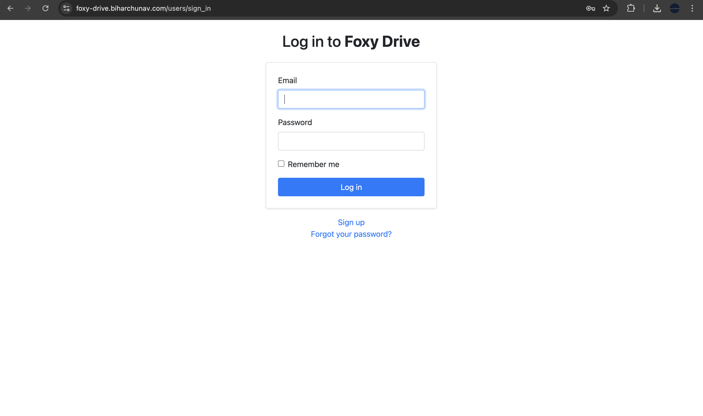
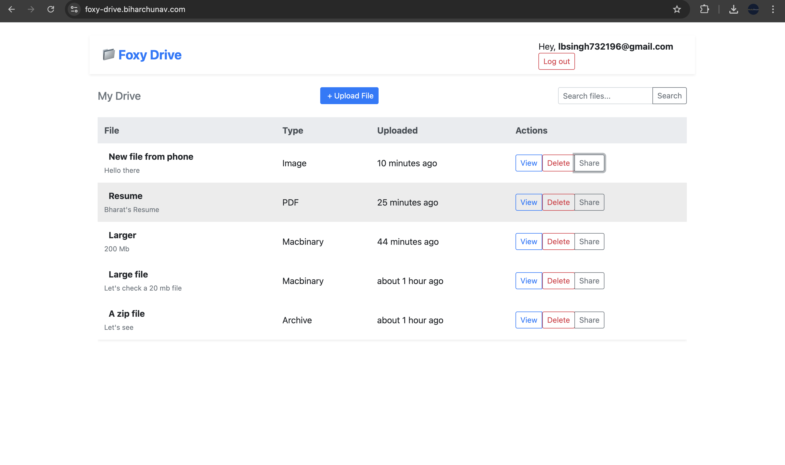
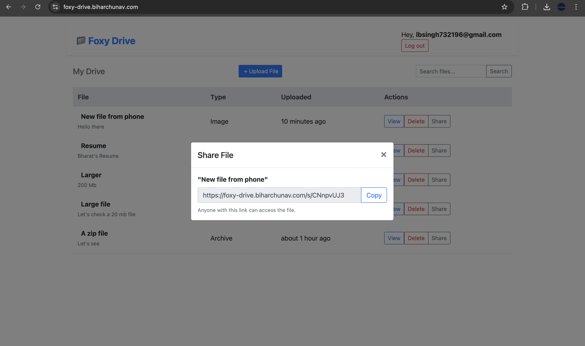

````markdown
# 📁 Foxy Drive

A secure, user-friendly file upload and sharing platform built with Ruby on Rails.  
Deployed at 👉 [foxy-drive.biharchunav.com](https://foxy-drive.biharchunav.com)

---

## ✨ Features

- 🔐 **User Authentication** (Devise)
  - Sign up, login, logout
- 📄 **File Uploads (up to 1GB)**
  - Title, description, and file type detection
  - Active Storage with direct upload support
  - Real-time upload progress bar
- 🗃️ **Private File Dashboard**
  - View your uploaded files (not visible to others)
  - Search and paginate your files
  - Delete files anytime
- 🔗 **Public Shareable Links**
  - Generate short URLs for files
  - Public viewer page with file metadata and download button
- 🎨 Clean, responsive UI powered by Bootstrap 4

---

## 🚀 Live Demo

🌍 [https://foxy-drive.biharchunav.com](https://foxy-drive.biharchunav.com)

> Test it with your own files (max 1GB, any format). Works best on modern browsers.

---

## 🧰 Tech Stack

- **Backend:** Ruby on Rails 7/8
- **Auth:** Devise (email/password)
- **Uploads:** Active Storage (local)
- **Frontend:** Bootstrap 4, jQuery (for modal + progress events)
- **Pagination:** Kaminari
- **Database:** PostgreSQL (or SQLite in development)

---

## 🛠️ Setup Instructions

1. **Clone the repo:**

```bash
git clone https://github.com/believemecha/foxy_drive.git
cd foxy_drive
````

2. **Install dependencies:**

```bash
bundle install
yarn install
```

3. **Setup the database:**

```bash
rails db:setup
```

4. **Start the server:**

```bash
bin/dev
```

5. **Visit:**

```
http://localhost:3000
```

---

## 📂 File Upload Specs

* Supports files up to **1GB**
* Auto-detects file type (`content_type`)
* Private by default
* Optional description for clarity
* Real-time progress bar

---

## 🔗 Public Sharing

Each uploaded file has a unique **short token** (e.g. `/s/abc123de`) that opens a public preview/download page.

Visitors can:

* View file metadata
* See the uploader
* Download the file

---

## 📸 Screenshots

### 📝 Sign Up


---

### 🔐 Login



---

### 🗃️ Dashboard (My Drive)

Upload, search, delete, and share files.


---

### 🔗 Share File Modal

Copy and share public links.


---

### 🌍 Public Share Page

Clean public view with download button.


---

## ✅ Completed Requirements (per EkAnek assignment)

* ✅ User login via email/password
* ✅ File upload with title, description, and type detection
* ✅ Private file list per user
* ✅ File deletion
* ✅ Public share via short URL
* ✅ Direct uploads for large files (up to 1GB)
* ✅ UI with search and pagination

---

## 📌 Notes

* All core features implemented as per assignment
* Committed regularly with meaningful messages
* Total time spent: *2.5 hours* (update accordingly)

---

## 🧑‍💻 Author

Made with ❤️ by [Bharat Bhushan](https://github.com/believemecha)

---

## 📄 License

MIT

```

---